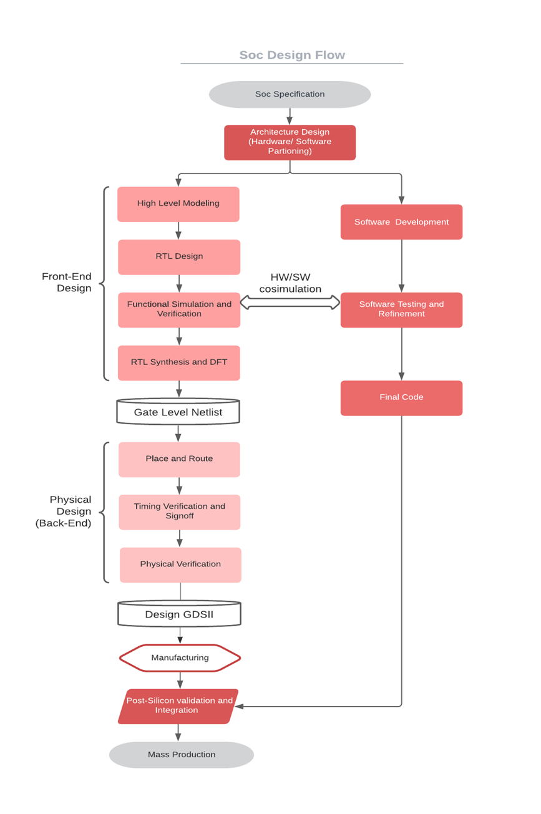
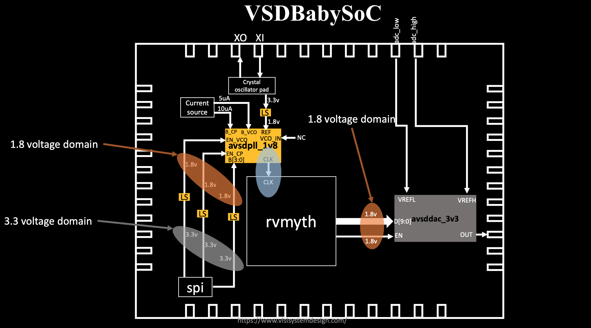

# Part 1: Baby SoC Fundamentals (Research Summary)

This week focuses on **Baby SoC fundamentals** as part of research-based learning. The content here is derived from the provided report, and this README summarizes the key concepts, definitions, and components.

---

##  Table of Contents
1. [System-on-Chip (SoC)](#1-system-on-chip-soc)  
2. [Key Components of a SoC](#2-key-components-of-a-soc)  
3. [Types of SoCs](#3-types-of-socs)  
   3.1 [Microcontroller-based SoC](#31-microcontroller-based-soc)  
   3.2 [Microprocessor-based SoC](#32-microprocessor-based-soc)  
   3.3 [Application-specific SoC (ASIC-based)](#33-application-specific-soc-asic-based)  
4. [SoC Design Flow](#4-soc-design-flow)  
5. [Introduction to VSD Baby SoC](#5-introduction-to-vsd-baby-soc)  
   5.1 [RVMyth SoC](#51-rvmyth-soc)  
   5.2 [PLL (Phase-Locked Loop)](#52-pll-phase-locked-loop)  
   5.3 [DAC (Digital-to-Analog Converter)](#53-dac-digital-to-analog-converter)  
6. [Summary](#6-summary)  

---
## 1. System-on-Chip (SoC)

A **System-on-Chip (SoC)** is a **mini computer integrated on a single chip**, combining CPU, memory, peripherals, and interconnects into a compact form. This integration allows devices to perform complex tasks while maintaining small form factor and low power consumption. SoCs are widely used in mobile devices, embedded systems, and IoT applications due to their versatility and efficiency.

---

## 2. Key Components of a SoC

A typical **System-on-Chip (SoC)** integrates several essential components on a single chip. These components work together to perform computation, store data, and interact with external devices. The main components include:

**A. CPU (Central Processing Unit)**  
   - The brain of the SoC that executes instructions and manages operations.  
   - Can be single-core or multi-core depending on performance needs.  
   - Coordinates all other components and handles data processing tasks.

**B. Memory**  
   - **RAM (Random Access Memory):** Temporary storage for data and instructions, allowing fast access during program execution.  
   - **ROM (Read-Only Memory):** Permanent storage for firmware, boot instructions, or system configuration data.

**C. Peripherals / Input-Output (I/O)**  
   - Interfaces to connect the SoC with external devices such as sensors, displays, communication modules, and user interfaces.  
   - Examples include UART, SPI, I2C interfaces, GPIOs, ADCs, and DACs.

**D. Graphics Processing Unit (GPU)**  
   - Responsible for creating visuals on your screen.  
   - Used for gaming, watching videos, or any activity involving images or animations.

**E. Digital Signal Processor (DSP)**  
   - Specialized in processing audio and video signals.  
   - Helps with tasks like noise reduction in phone calls or enhancing video quality.

**F. Power Management**  
   - Regulates power usage within the SoC, ensuring efficient operation.  
   - Crucial for extending battery life in portable devices.

**G. Special Features**  
   - Additional features may include Wi-Fi, Bluetooth, and security modules for safe data handling.  
   - These features vary depending on the specific purpose of the SoC.

---

**Key features of SoCs:**
- Space-saving – multiple components on a single chip.  
- Energy-efficient – low power usage compared to discrete components.  
- High-performance – optimized integration enables faster processing.  
- Cost-effective – reduces manufacturing costs and PCB space.  
- Reliable – fewer connections mean lower chances of failure.  

**Applications:** SoCs are found in smartphones, tablets, wearables, automotive electronics, smart appliances, and IoT devices.  

**Popular SoCs:**
- Apple A-series – used in iPhones and iPads.  
- Qualcomm Snapdragon – used in Android smartphones.  
- Samsung Exynos – featured in Samsung devices.  
- NVIDIA Tegra – used in gaming consoles and automotive systems.  

**Challenges with SoCs:**
- Complex design – integrating multiple blocks on one chip is challenging.  
- Heat management – high performance generates thermal issues that require careful design.  
- Less flexible – upgrading or modifying components after fabrication is difficult.

---

## 3. Types of SoCs

1. **Microcontroller-based SoC:** Low-power SoC for embedded applications, combining CPU, memory, and peripherals on a single chip. Often used in IoT devices, home automation, and small electronics.  

2. **Microprocessor-based SoC:** Designed for more computationally intensive tasks, usually paired with external memory. Commonly found in smartphones, tablets, and single-board computers.  

3. **Application-specific SoC (ASIC-based):** Customized for a particular application to optimize performance, power, and cost. Examples include graphics processors, AI accelerators, and automotive SoCs.

---

## 4. SoC Design Flow

The SoC design flow defines the stages from conceptualization to implementation. It starts with specification, functional modeling, RTL design, verification, synthesis, and finally physical implementation. Following a systematic flow ensures correctness and efficiency in SoC design.  

---

## 5. Introduction to VSD Baby SoC

- VSDBabySoC is a **compact yet highly capable System-on-Chip (SoC)** based on the **RISC-V architecture**.  
- It is designed to facilitate **learning, testing, and experimentation** with RISC-V cores in a simplified environment.  
- The SoC integrates both **digital and analog components**, making it suitable for functional modeling and early verification of system designs.

**Main Components:**

1. **RVMyth SoC** – *RISC-V Microprocessor for You in 30 Minutes*  
   - A small RISC-V processor designed for rapid educational deployment.  
   - Demonstrates basic CPU operations, instruction execution, and SoC integration.  

   

2. **PLL (Phase-Locked Loop)**  
   - Generates stable and synchronized clock signals necessary for proper SoC operation.  
   - Prevents timing errors that could occur if off-chip clocks were used.  
   - Ensures the system operates reliably even when different components have different timing requirements.  
   *(Screenshot placeholder)*  
   

3. **DAC (Digital-to-Analog Converter)**  
   - Converts digital signals from the processor into analog signals for output devices.  
   - Two common types:  
     - **Weighted Binary Resistor DAC** – uses a set of resistors weighted by binary values.
 
     

     - **R-2R Resistor DAC** – uses a resistor ladder for precise conversion.  

          

   - DACs are widely used in audio, sensors, and actuator interfaces.  

---

## 6. Summary

This research-based summary provides a strong understanding of Baby SoC fundamentals, including:  
- SoC definition, components, types, and applications  
- Advantages and challenges of SoCs  
- VSD Baby SoC components and functionalities (RVMyth, PLL, DAC)  

These concepts form the foundation for **hands-on functional modeling** and further exploration in upcoming lab sessions.

---
