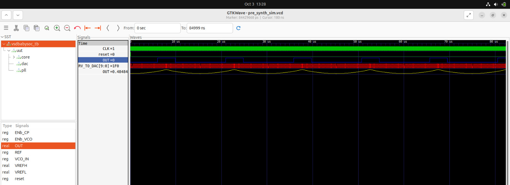
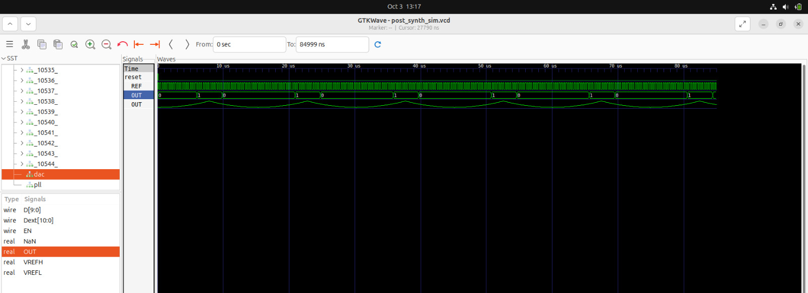

# Part 2 – Labs (Hands-on Functional Modeling of VSDBabySoC)

In this section, I performed **hands-on functional modeling labs** on the VSDBabySoC project. These labs helped me explore how the different components of the SoC—the RVMYTH CPU, the PLL, and the DAC—work together to process and output data.

Through these exercises, I was able to:

- Observe how the **RVMYTH CPU** updates registers like `r17` during execution.  
- Understand how the **PLL generates a stable clock** to synchronize all modules.  
- Visualize how the **DAC converts digital values into analog signals**.  
- Analyze the SoC’s behavior **before and after synthesis** using simulation waveforms.

These labs gave me a practical understanding of **mixed-signal SoC operation**, showing how digital processing and analog output are linked in a real system.

---

## Overview

This SoC combines **digital processing** and **analog interfacing**:

- The **RVMYTH CPU** executes instructions, cycles through data, and prepares values for analog output.  
- A **phase-locked loop (PLL)** generates a stable clock, keeping all components synchronized.  
- A **10-bit DAC** converts CPU-generated digital values into analog signals that can drive external devices like speakers, displays, or TVs.

In essence, VSDBabySoC shows how a small digital CPU can communicate with real-world analog devices.

---

## Key Components

| Component | Role |
|-----------|------|
| **RVMYTH CPU** | The brain of the SoC. It performs calculations and updates registers, especially `r17` which drives the DAC. |
| **PLL** | Generates a stable clock to keep CPU and DAC operations in sync. |
| **DAC** | Converts the digital values from CPU into analog signals. |
| **Registers** | `r17` holds the current value to be converted into analog output. |

---

## How It Works

### 1. Clock Generation

- The PLL takes a reference clock and multiplies it to generate a stable, higher-frequency clock for the SoC.  
- This ensures that the CPU, DAC, and other components all operate in **perfect harmony**.

### 2. Data Processing in RVMYTH

- The `r17` register is the heart of CPU-to-DAC communication.  
Here’s a simple example:

1. CPU starts with `r17 = 0`.  
2. Adds the value of `r11` to `r17`.  
3. Updates `r11` for the next cycle.  
4. Loops continuously, producing a stream of values for the DAC.

- This creates a **smooth, continuous data flow** that the DAC can turn into analog signals.

### 3. Analog Signal Generation

The DAC reads `r17` values and converts them using the formula:

```bash
OUT = VREFL + D/1023 * (VREFH - VREFL)
```

- `VREFL` and `VREFH` define the output voltage range.  
- `D` is the 10-bit value from `r17`.  
- `OUT` is the analog voltage delivered to connected devices.

---

## Visualizing Signals with GTKWAVE

GTKWAVE is used to **see what’s happening inside the SoC**:

- Watch the CPU cycle through values in `r17`.  
- Observe how the DAC converts these values into analog signals (`OUT`).  
- Monitor the clock (`CLK`) generated by the PLL.  

This is an essential step to **validate the design before and after synthesis**.

---

## Simulation Walkthrough

  1. **First we need to install some important packages:**

  ```bash
  $ sudo apt install make python python3 python3-pip git iverilog gtkwave docker.io
  $ sudo chmod 666 /var/run/docker.sock
  $ cd ~
  $ pip3 install pyyaml click sandpiper-saas
  ```

  2. **Now we can clone this repository in an arbitrary directory (we'll choose home directory here):**

  ```bash
  $ cd ~
  $ git clone https://github.com/manili/VSDBabySoC.git

  ```
 3. **It's time to make the `pre_synth_sim.vcd`:**

  ```bash
  $ cd VSDBabySoC
  $ make pre_synth_sim

  ```
  
  The result of the simulation (i.e. `pre_synth_sim.vcd`) will be stored in the `output/pre_synth_sim` directory.

  4. **Now for `Post_synth_sim.vcd`:**

  ```bash
  $ cd VSDBabySoC
  $ make post_synth_sim
  ```

  The result of the simulation (i.e. `post_synth_sim.vcd`) will be stored in the `output/post_synth_sim` directory.

  5. **We can see the waveforms by following command:**

  - **For pre simulation wave** 

  ```bash
  $ gtkwave output/pre_synth_sim/pre_synth_sim.vcd
  ```
  - **For Post simulation wave**

  ```bash
  $ gtkwave output/post_synth_sim/post_synth_sim.vcd
  ```
  
  Two most important signals are `CLK` and `OUT`. The `CLK` signal is provided by the PLL and the `OUT` is the output of the DAC model. 

   

### My Observations from VSDBabySoC Simulation (Pre-Synthesis)

| Signal                  | Source                     | Observation                                                                                   |
|-------------------------|----------------------------|-----------------------------------------------------------------------------------------------|
| **CLK**                 | PLL                        | Stable and synchronized. Ensures correct execution of RVMYTH instructions.                  |
| **reset**               | External input             | Initializes the CPU correctly. All registers, including `r17`, start from a known state.    |
| **OUT (VSDBabySoC)**    | DAC                        | Appears as a digital signal in simulation due to Icarus Verilog limitations.                |
| **RV_TO_DAC[9:0]**      | Register `r17` (RVMYTH)  | Updates sequentially with instruction execution. This is the data sent to the DAC.          |
| **OUT (DAC, real type)** | DAC                        | Shows accurate analog waveform. This is the signal to observe for real analog output.        |

**Note:**
  
Real variables are not supported during synthesis, so `VSDBabySoC.OUT` must be a `wire`, which behaves digitally in simulation. To observe analog behavior, use `DAC.OUT`.


### Post Synthesis simulation


- The post synthesis simulation matches the pre synthesis simulation perfectly.
- Thus the synthesis of `VSDBabySoC` is passed without any errors.

---
